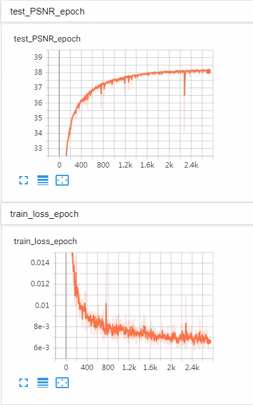

# N_SR
 
There are some implements of SR methods with Pytorch.   
* SAN in san.py ([Photo-Realistic Single Image Super-Resolution Using a Generative Adversarial Network](http://openaccess.thecvf.com/content_CVPR_2019/papers/Dai_Second-Order_Attention_Network_for_Single_Image_Super-Resolution_CVPR_2019_paper.pdf))
* RCAN in rcan.py ([Image Super-Resolution Using Very Deep Residual Channel Attention Networks](http://openaccess.thecvf.com/content_ECCV_2018/papers/Yulun_Zhang_Image_Super-Resolution_Using_ECCV_2018_paper.pdf))
* DBPN in dbpn.py ([Deep Back-Projection Networks For Super-Resolution](https://arxiv.org/abs/1904.05677))
* RDN in rdn.py ([Residual Dense Network for Image SR](https://arxiv.org/pdf/1802.08797v2.pdf))
* EDSR in edsr.py ([Enhanced Deep Residual Networks for Single Image Super-Resolution](https://arxiv.org/abs/1707.02921))
* SRResNet in srresnet.py ([Photo-Realistic Single Image Super-Resolution Using a Generative Adversarial Network](https://arxiv.org/abs/1609.04802))

## Dependencies
* Python 3.5.3
* Pytorch 1.1.0
* tensorboardX

### Getting started
* Train: `python main.py`. More details in `option.py` 
* Test: `python eval.py`.

## Experiments on FEI face dateset (without augmentation)
Image-based algoritnms.
|Algorithms|Bicubic|EDSR_original|EDSR+b16k64|EDSR+b32k256|SRResNet|RDN|DBPN|RCAN|
|:---:|:---:|:---:|:---:|:---:|:---:|:---:|:---:|:---:|
|PSNR | 36.38 | 39.81 | 39.85 | 40.05 | 40.04 | 39.90 | 40.14 | 40.03 |

Patch-based algoritnms.
|Algorithms|Bicubic|SRCNN_original|VDSR_original|
|:---:|:---:|:---:|:---:|
|PSNR | 36.38 | 38.58 | 39.54 |

`tensorboard --logdir log` 

The train/test loss and PSNR curves for each experiment are shown below: 

